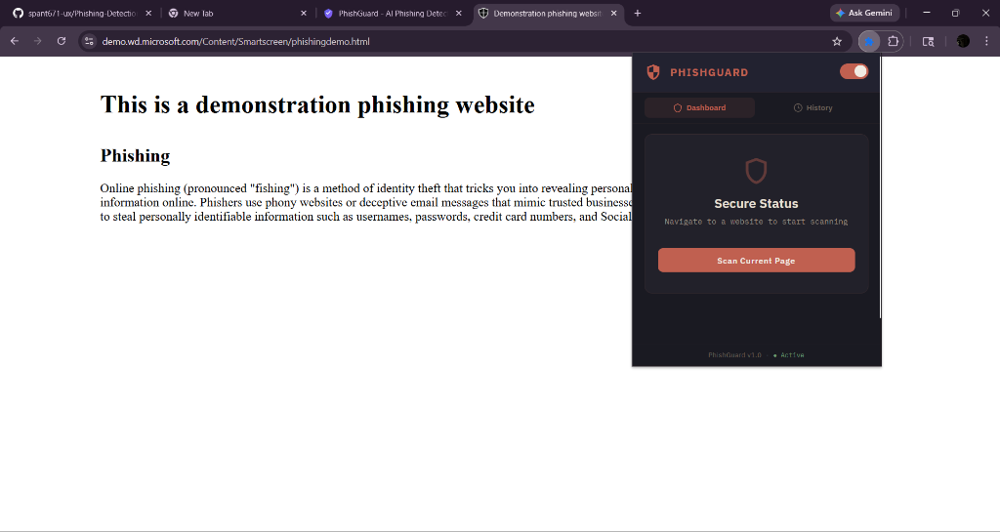
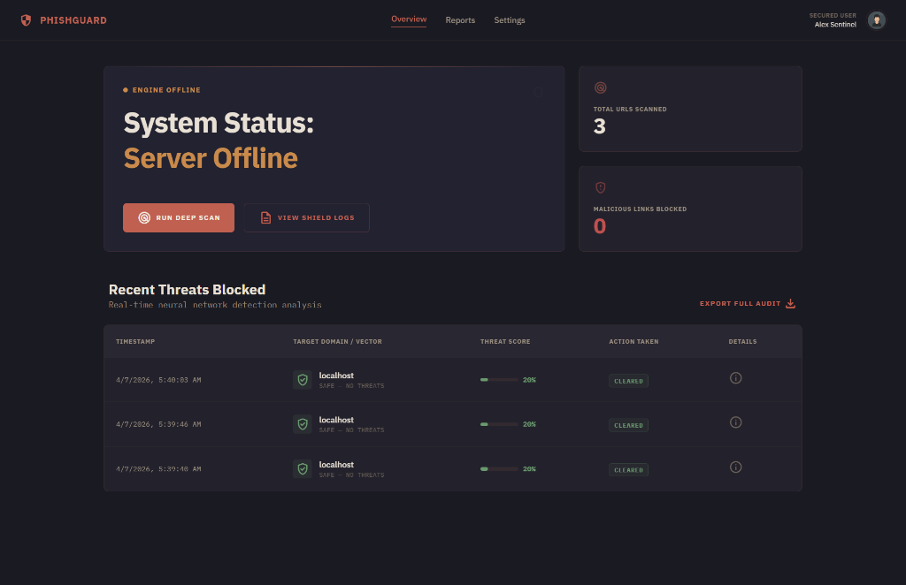

# 🛡️ PhishGuard — AI-Powered Phishing Detection System

A real-time phishing detection browser extension and web dashboard that combines **LLM intelligence** (Ollama/Gemma) with a **rule-based heuristic engine** to protect users from malicious websites.


---

## 📸 Screenshots

### 🔌 Browser Extension — Popup Dashboard
<p align="center">
  
</p>

### 🖥️ Web Dashboard — Threat Overview
<p align="center">
  
</p>

---

## 📁 Project Structure

```
hckthn/
├── Client/                  # React Web Dashboard (Vite + TailwindCSS)
│   ├── src/
│   │   ├── App.jsx          # Main app with scanner & history
│   │   ├── index.css        # TailwindCSS v4 design system
│   │   ├── main.jsx         # Entry point
│   │   └── components/
│   │       ├── Header.jsx       # Nav & server status
│   │       ├── HeroSection.jsx  # Hero with stats
│   │       ├── LiveScanner.jsx  # URL scanner & results
│   │       ├── ScanHistory.jsx  # History list
│   │       ├── HowItWorks.jsx   # Architecture explainer
│   │       └── Footer.jsx       # Footer
│   ├── index.html
│   ├── vite.config.js
│   └── package.json
│
├── Server/                  # Express Backend API
│   ├── index.js             # Express server with /analyze endpoint
│   ├── services/
│   │   ├── llmService.js    # Ollama/Gemma integration
│   │   └── ruleEngine.js    # Heuristic phishing detection
│   ├── utils/
│   │   └── sanitize.js      # Input sanitization
│   └── package.json
│
├── Extension/               # Chrome Extension (Manifest V3)
│   ├── manifest.json        # Extension manifest
│   ├── background.js        # Service worker (tab monitoring)
│   ├── content.js           # Content script (DOM extraction + overlays)
│   ├── popup.html           # Popup entry
│   ├── popup.js             # Popup dashboard UI
│   ├── popup.css            # Popup styles (dark mode)
│   └── icons/               # Extension icons
│
└── README.md
```

---

## 🚀 Quick Start

### Prerequisites
- **Node.js** v18+
- **Google Chrome** browser
- **Ollama** (optional, for AI analysis)

### 1. Start the Backend Server

```bash
cd Server
npm install
npm start
```

Server will run on **http://localhost:5000**

### 2. Set Up Ollama + Gemma (Optional but Recommended)

```bash
# Install Ollama
# Visit: https://ollama.com/download

# Pull the Gemma model
ollama pull gemma3

# Ollama runs automatically on http://localhost:11434
```

> **Note:** The system works without Ollama! It falls back to rule-based-only analysis if the LLM is unavailable.

### 3. Start the Web Dashboard (Optional)

```bash
cd Client
npm install
npm run dev
```

Dashboard available at **http://localhost:3000**

### 4. Load the Chrome Extension

1. Open Chrome and go to `chrome://extensions/`
2. Enable **Developer mode** (toggle in top-right)
3. Click **"Load unpacked"**
4. Select the `Extension/` folder
5. The PhishGuard icon will appear in your toolbar!

---

## 🧩 Features

### ✅ Automatic URL Scanning
- Detects every page navigation via `chrome.tabs.onUpdated`
- Debounced scanning (1.5s) to prevent duplicate analysis
- Skips internal Chrome pages

### ✅ Content Analysis
- Content script extracts page title, headings, links, forms, meta tags
- Limits extraction to 2000 characters for performance
- Sends extracted text to backend for LLM analysis

### ✅ AI Analysis (Ollama/Gemma)
- Structured prompt forces JSON-only output
- Low temperature (0.1) for consistent results
- 30 second timeout with graceful fallback
- Returns: `{ is_phishing, confidence, reasons[] }`

### ✅ Rule-Based Engine (12+ Checks)
- URL length analysis
- IP address detection
- `@` symbol detection (redirect obfuscation)
- Excessive hyphens in domain
- Suspicious TLD checking (.tk, .ml, .xyz, etc.)
- Subdomain count analysis
- Brand impersonation detection (PayPal, Google, etc.)
- URL encoding detection
- Non-standard port detection
- HTTPS check
- Punycode/IDN homograph detection
- Content keyword analysis (urgency, threats)

### ✅ Decision Engine
```
final_score = (0.7 × llm_score) + (0.3 × rule_score)

Safe:       0-39%  → No interruption
Suspicious: 40-69% → Warning banner
Phishing:   70-100% → Full-page blocking overlay
```

### ✅ Warning Overlays
- **Phishing:** Full-page blocking overlay with "Go Back to Safety" button
- **Suspicious:** Slide-down warning banner (auto-dismiss after 10s)
- **Safe:** No interruption

### ✅ Popup Dashboard
- Current URL risk status with animated score bar
- LLM vs Rule engine score breakdown
- Analysis reasons list
- Scan toggle (ON/OFF)
- Scan history tab

### ✅ Web Dashboard
- Premium dark UI with glassmorphism
- Live URL scanner with quick-test buttons
- Scan history visualization
- Architecture explainer section
- Server status indicator

### ✅ Caching & Performance
- URL results cached for 10 minutes (both client & server)
- Content limited to 2000 characters
- Debounced scanning prevents redundant requests
- LRU cache eviction (500 entries max)

### ✅ Security
- HTML/script tag stripping on all inputs
- XSS prevention via `escapeHtml()` in overlay content
- CORS restricted to extension and localhost
- Payload size limited to 50KB
- No public API exposure

---

## 🔌 API Reference

### POST /analyze
Analyze a URL for phishing risk.

**Request:**
```json
{
  "url": "https://suspicious-site.tk/login",
  "content": "Verify your PayPal account immediately..."
}
```

**Response:**
```json
{
  "url": "https://suspicious-site.tk/login",
  "is_phishing": true,
  "risk_level": "phishing",
  "final_score": 82,
  "llm_score": 90,
  "rule_score": 65,
  "reasons": [
    "Possible paypal impersonation in URL",
    "Suspicious TLD: .tk",
    "Suspicious phrase: \"verify your account\""
  ],
  "llm_available": true,
  "timestamp": "2026-04-06T08:30:00.000Z"
}
```

### GET /history
Returns recent scan history (default: 50, max: 200).

### GET /health
Health check endpoint.

---

## 🧪 Sample Test Cases

| URL | Expected Result | Score |
|-----|----------------|-------|
| `https://www.google.com` | ✅ Safe | <10% |
| `https://www.github.com` | ✅ Safe | <10% |
| `http://paypal-secure-login.suspicious.tk/verify` | 🚨 Phishing | >70% |
| `http://192.168.1.1/@google-security-check` | 🟡 Suspicious | 40-70% |
| `http://sub1.sub2.sub3.sub4.example.com/login` | 🟡 Suspicious | 40-60% |
| `http://g00gle-security-alert.xyz/verify-now` | 🚨 Phishing | >70% |
| `http://xn--goog1e.com/account` | 🟡 Suspicious | 40-60% |

---

## ⚙️ Configuration

### Environment Variables (Server)
| Variable | Default | Description |
|----------|---------|-------------|
| `PORT` | `5000` | Server port |
| `OLLAMA_URL` | `http://localhost:11434/api/generate` | Ollama API endpoint |
| `OLLAMA_MODEL` | `gemma3` | Model to use |

---

## 🏗️ Architecture

```
┌──────────────────────┐     ┌─────────────────────┐
│   Chrome Extension   │     │   Web Dashboard     │
│                      │     │   (React + Vite)    │
│  ┌─────────────┐     │     │                     │
│  │ background  │────────────────────┐            │
│  │ .js         │     │     │        │            │
│  └──────┬──────┘     │     │        ▼            │
│         │            │     │   ┌─────────────┐   │
│  ┌──────▼──────┐     │     │   │ LiveScanner │   │
│  │ content.js  │     │     │   └──────┬──────┘   │
│  │ (extract +  │     │     │          │          │
│  │  overlay)   │     │     └──────────│──────────┘
│  └─────────────┘     │               │
│                      │               │
│  ┌─────────────┐     │               │
│  │ popup.js    │     │               │
│  │ (dashboard) │     │               │
│  └─────────────┘     │               │
└──────────────────────┘               │
                                       ▼
                            ┌─────────────────────┐
                            │   Express Server    │
                            │   POST /analyze     │
                            │                     │
                            │  ┌────────────────┐ │
                            │  │  LLM Service   │ │
                            │  │  (Ollama API)  │ │
                            │  └────────────────┘ │
                            │                     │
                            │  ┌────────────────┐ │
                            │  │  Rule Engine   │ │
                            │  │  (Heuristics)  │ │
                            │  └────────────────┘ │
                            │                     │
                            │  ┌────────────────┐ │
                            │  │  Decision      │ │
                            │  │  Engine        │ │
                            │  │  (70/30 mix)   │ │
                            │  └────────────────┘ │
                            └─────────────────────┘
```

---

## 🎁 Bonus Features
- ✅ **Dark Mode UI** — Premium dark theme across popup and dashboard
- ✅ **Risk Score Visualization** — Animated progress bars with color coding
- ✅ **API Fallback** — Graceful degradation when Ollama is offline (rule-based only)
- ✅ **Scan Caching** — Avoids redundant analysis
- ✅ **Quick Test URLs** — One-click test with known patterns

---

## 📄 License

MIT License — Built for educational and security research purposes.
